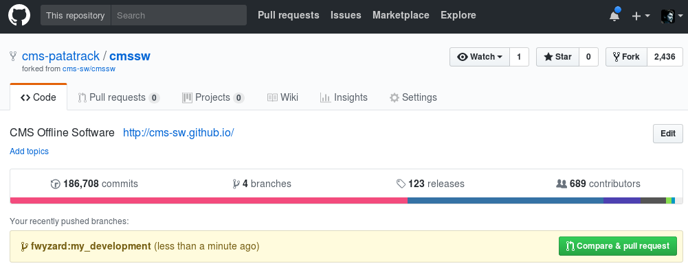

## Simple recipe for developing with Patatrack
The current Patatrack development branch is based on `CMSSW_10_2_X`, and supports the architecture `slc7_amd64_gcc700`.

## Installing `CMSSW_10_2_0_Patatrack`
While it is possible to start from the vanilla `CMSSW_10_2_0`, using this dedicated release has the advantage of not having to rebuild many packages.

If you are working on **vinavx2** you can skip these steps, as the release is already available.

### Setup a local installation of CMSSW
Choose for `VO_CMS_SW_DIR` a directory to which you have write permissions, and has at least 20 GB of spare disk space.  
**Do not** use a directory on EOS.

```bash
export VO_CMS_SW_DIR=<...>
export SCRAM_ARCH=slc7_amd64_gcc700
export LANG=C
wget http://cmsrep.cern.ch/cmssw/repos/bootstrap.sh -O $VO_CMS_SW_DIR/bootstrap.sh
chmod a+x $VO_CMS_SW_DIR/bootstrap.sh
$VO_CMS_SW_DIR/bootstrap.sh -a slc7_amd64_gcc700 -r cms -path $VO_CMS_SW_DIR setup
```

### Install locally CMSSW_10_2_0
This is necessary to get the latest external packages:
```bash
$VO_CMS_SW_DIR/common/cmspkg -a slc7_amd64_gcc700 install -y cms+cmssw+CMSSW_10_2_0
```

### Install the dependencies and `CMSSW_10_2_0_Patatrack`
```bash
$VO_CMS_SW_DIR/common/cmspkg -a slc7_amd64_gcc700 -- rpm --prefix=$VO_CMS_SW_DIR --nodeps -i \
  http://cern.ch/fwyzard/patatrack/rpms/cmssw_1020/slc7_amd64_gcc700/cms+cmssw+CMSSW_10_2_0_Patatrack-1-1.slc7_amd64_gcc700.rpm
```

## Create a working area for `CMSSW_10_2_0_Patatrack`

On **vinavx2** set `VO_CMS_SW_DIR=/data/cmssw`.

### Source the local installation
```bash
export VO_CMS_SW_DIR=<...>
export SCRAM_ARCH=slc7_amd64_gcc700
source $VO_CMS_SW_DIR/cmsset_default.sh
```

### Set up a working area
```bash
scram list CMSSW_10_2_0
cmsrel CMSSW_10_2_0_Patatrack
cd CMSSW_10_2_0_Patatrack/src
cmsenv
```

### Set up the `git` repository
```bash
git cms-init --upstream-only || true
# you will see the error
#     fatal: Not a valid object name: 'CMSSW_10_2_0_Patatrack'.
# it is expected, just follow the rest of the instructions
git config core.sparsecheckout true
{
  echo "/.gitignore"
  echo "/.clang-tidy"
  echo "/.clang-format"
} > $CMSSW_BASE/src/.git/info/sparse-checkout
git read-tree -mu HEAD

# add the Patatrack remote and branches
git cms-remote add cms-patatrack
git checkout CMSSW_10_2_0_Patatrack -b CMSSW_10_2_X_Patatrack
git branch -u cms-patatrack/CMSSW_10_2_X_Patatrack
git checkout CMSSW_10_2_0_Patatrack -b from-CMSSW_10_2_0_Patatrack

# enable the developer's repository
git cms-init
```

Now you should be able to work in the `from-CMSSW_10_2_0_Patatrack` branch as you would in a normal CMSSW development area.

### Check out the patatrack development branch
To work on further developments, it is advised to start from the HEAD of the patatrack branch.

```bash
cmsenv
git checkout cms-patatrack/CMSSW_10_2_X_Patatrack -b my_development
# check out the modified packages and their dependencies
git cms-addpkg $(git diff $CMSSW_VERSION --name-only | cut -d/ -f-2 | sort -u)
git cms-checkdeps -a
scram b -j
```

### Write code, compile, debug, commit, and push to your repository
```bash
...
scram b -j
...
git add ...
git commit
git push -u my-cmssw HEAD:my_development
```

## Create a pull request
  - before your PR can be submitted, you should kindly run a couple of checks to make the integration process much smoother:
  ```bash
  #recompile using debug
  scram b clean && USER_CXXFLAGS="-g -rdynamic" USER_CUDA_FLAGS="-g -G" scram b -j
  ...
  #run your code under cuda-memcheck
  cuda-memcheck --tool initcheck --print-limit 1 cmsRun step3.py
  cuda-memcheck --tool synccheck --print-limit 1 cmsRun step3.py
  cuda-memcheck --tool memcheck --print-limit 1 cmsRun step3.py
  ```


  - open https://github.com/cms-patatrack/cmssw

  - there should be box with the branch you just created and a green button saying "Compare & pull request":
    

  - click on it, and create a pull request as usual:
    

  - make sure to choose `CMSSW_10_2_X_Patatrack` as the target branch
